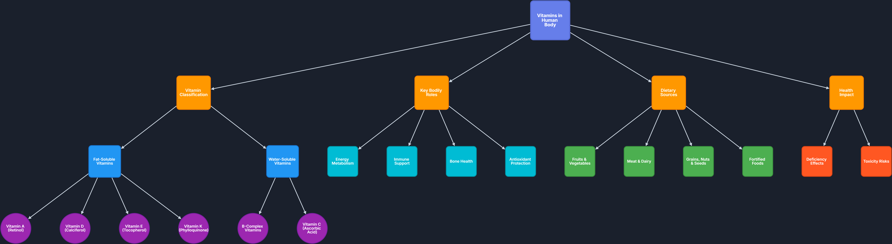

# Interactive Mindmap Visualizer

[](https://recsify-kathir.netlify.app/)
[](https://recsify-kathir.netlify.app/)

An interactive, data-driven mindmap visualization built with React and Cytoscape.js. This project demonstrates hierarchical data visualization with rich user interactions including hover tooltips, node selection, expand/collapse functionality, and smooth zoom/pan controls.

**🚀 [View Live Demo](https://recsify-kathir.netlify.app/)**



## 📋 Table of Contents

- [Overview](#overview)
- [Features](#features)
- [Technology Stack](#technology-stack)
- [Installation](#installation)
- [Usage](#usage)
- [Data Structure](#data-structure)
- [Architecture](#architecture)
- [Customization](#customization)
- [Screenshots](#screenshots)
- [Demo Video](#demo-video)

---

## 🎯 Overview

This project is an **interactive mindmap UI** that visualizes hierarchical data as a graph with nodes and connections. It was built to meet the requirements of a frontend development internship assignment, showcasing the ability to create complex, interactive user interfaces with data-driven visualizations.

The mindmap displays information about **Vitamins in the Human Body**, but can be easily adapted to visualize any hierarchical data by simply changing the JSON data file.

---

## ✨ Features

### Core Functionality

- **📊 Data-Driven Visualization**: Entire mindmap generated from JSON file
- **🖱️ Interactive Nodes**: Click to select, hover for quick info
- **🔍 Zoom & Pan**: Smooth mouse-wheel zooming and drag-to-pan
- **📖 Detailed Sidebar**: Shows comprehensive information for selected nodes
- **💡 Hover Tooltips**: Quick summaries on node hover
- **🌳 Expand/Collapse**: Toggle visibility of node branches
- **🎯 Fit View**: Auto-fit mindmap to viewport
- **🔄 Reset View**: Return to default zoom and position
- **🌓 Dark/Light Theme**: Toggle between themes with localStorage persistence
- **🎨 Type-Based Styling**: Different colors for different node types

### User Interactions Implemented

✅ Hover interactions with contextual tooltips  
✅ Click interactions with node selection  
✅ Highlight related nodes and edges  
✅ Expand/collapse node branches  
✅ Smooth pan and zoom  
✅ Fit to view and reset view  
✅ **Right-click context menu** (edit, expand, focus, delete)  
✅ **Inline node editing** with dialog  
✅ **Export as PNG/JSON**  
✅ **Smooth animations** on all interactions  
✅ **Double-click to expand single node**  
✅ **Search functionality** with dropdown results  
✅ **Multiple layout algorithms** (6 different options)  
✅ **Keyboard shortcuts** for common actions  
✅ **Drag-to-reposition** nodes  
✅ **Mini-map** for navigation  
✅ **Custom themes** (Light, Dark, Ocean, Forest, Sunset)

---

## 🛠️ Technology Stack

### Core Technologies

- **React 18** - UI framework for component-based architecture
- **Vite** - Fast build tool and development server
- **Cytoscape.js** - Graph visualization library for rendering the mindmap
- **cytoscape-dagre** - Hierarchical layout algorithm for organizing nodes
- **Dagre** - Graph layout engine
- **Tailwind CSS** - Utility-first CSS framework for styling

### Development Tools

- **ESLint** - Code linting
- **PostCSS** - CSS processing
- **Autoprefixer** - CSS vendor prefixing

### Why These Technologies?

- **Cytoscape.js**: Industry-standard graph visualization library with excellent performance and extensive features
- **React**: Component-based architecture allows for modular, maintainable code
- **Vite**: Lightning-fast hot module replacement for great developer experience
- **Tailwind**: Rapid UI development with consistent design system

---

## 📦 Installation

### Prerequisites

- Node.js (v16 or higher)
- npm or yarn package manager

### Setup Steps

1. **Clone or extract the project**
   ```bash
   cd recsify
   ```

2. **Install dependencies**
   ```bash
   npm install
   ```

3. **Start development server**
   ```bash
   npm run dev
   ```

4. **Open in browser**
   - Navigate to `http://localhost:3000`
   - The app should open automatically

### Build for Production

```bash
npm run build
```

The production build will be in the `dist/` folder.

### Preview Production Build

```bash
npm run preview
```

---

## 🚀 Usage

### Basic Navigation

1. **View the Mindmap**: The full hierarchical structure loads automatically
2. **Zoom**: Use mouse wheel or zoom buttons (+/-)
3. **Pan**: Click and drag on the background
4. **Select Node**: Click any node to view details in the sidebar
5. **Hover**: Hover over nodes to see quick summaries
6. **Right-Click**: Right-click nodes for context menu (edit, expand, focus, delete)
7. **Edit Node**: Use context menu to edit node labels and descriptions
8. **Expand/Collapse**: Use control buttons to show/hide branches
9. **Fit View**: Click "Fit View" to auto-fit all visible nodes
10. **Reset**: Click "Reset View" to return to default state
11. **Export**: Export mindmap as PNG image or download JSON data
12. **Theme**: Click the theme toggle button (top-right) to switch themes

### Keyboard Shortcuts

- **Ctrl/Cmd + F**: Focus search bar
- **R**: Reset view
- **E**: Expand all nodes
- **C**: Collapse all nodes
- **+ / =**: Zoom in
- **- / _**: Zoom out
- **ESC**: Close menus/dialogs
- **Double-click node**: Expand single node
- **Right-click node**: Open context menu

### Mouse Controls

- **Click node**: Select and view details
- **Hover node**: Show tooltip
- **Drag node**: Reposition in graph
- **Drag background**: Pan view
- **Mouse wheel**: Zoom in/out
- **Right-click node**: Context menu

---

## 📊 Data Structure

The mindmap is **100% data-driven**. Changing the JSON file automatically updates the visualization.

### JSON File Location

```
public/data/mindmap-data.json
```

### Data Schema

```json
{
  "metadata": {
    "title": "Your Title",
    "description": "Description text",
    "contentType": "mindmap",
    "nodeCount": 23
  },
  "nodes": [
    {
      "id": "unique_id",
      "data": {
        "label": "Node Label",
        "type": "root|category|subcategory|vitamin|role|source|impact",
        "summary": "Brief summary for tooltip",
        "details": "Full description for sidebar"
      }
    }
  ],
  "edges": [
    {
      "source": "parent_id",
      "target": "child_id",
      "type": "categorizes|divides|includes"
    }
  ],
  "hierarchy": {
    "root": ["child1", "child2"],
    "child1": ["grandchild1", "grandchild2"]
  }
}
```

### Node Types and Colors

| Type | Color | Usage |
|------|-------|-------|
| `root` | Purple (#667eea) | Main topic |
| `category` | Orange (#FF9800) | Major categories |
| `subcategory` | Blue (#2196F3) | Subcategories |
| `vitamin` | Purple (#9C27B0) | Specific vitamins |
| `role` | Cyan (#00BCD4) | Functional roles |
| `source` | Green (#4CAF50) | Sources |
| `impact` | Red (#FF5722) | Health impacts |

### How to Add Your Own Data

1. Open `public/data/mindmap-data.json`
2. Update the `metadata` section with your topic info
3. Replace `nodes` array with your data
4. Update `edges` to define connections
5. Set `hierarchy` to define parent-child relationships
6. Save and refresh the app

**Example**: Create a mindmap about programming languages, company structure, biology concepts, etc.

---

## 🏗️ Architecture

### Project Structure

```
recsify/
├── public/
│   └── data/
│       └── mindmap-data.json       # Data source
├── src/
│   ├── components/
│   │   ├── MindmapCanvas.jsx       # Main graph component
│   │   ├── Sidebar.jsx             # Detail panel
│   │   ├── Tooltip.jsx             # Hover tooltip
│   │   ├── ContextMenu.jsx         # Right-click menu
│   │   └── EditNodeDialog.jsx      # Node editing modaluttons
│   │   ├── ThemeToggle.jsx         # Theme switcher
│   │   └── Tooltip.jsx             # Hover tooltip
│   ├── hooks/
│   │   ├── useMindmap.js           # Graph state logic
│   │   └── useTheme.js             # Theme management
│   ├── utils/
│   │   ├── cytoscapeConfig.js      # Graph styling & config
│   │   └── dataProcessor.js        # Data transformation
│   ├── App.jsx                     # Main app component
│   ├── main.jsx                    # Entry point
│   └── index.css                   # Global styles
├── package.json
├── vite.config.js
├── tailwind.config.js
└── README.md
```

### Component Architecture

```
App
├── ThemeToggle
├── MindmapCanvas (70% width)
│   ├── Cytoscape Instance
│   ├── Controls
│   └── Tooltip
└── Sidebar (30% width)
    ├── Project Header
    ├── Node Details Card
    └── Quick Tips
```

### Data Flow

1. **Load**: JSON fetched from `/public/data/mindmap-data.json`
2. **Process**: `dataProcessor.js` transforms JSON into Cytoscape format
3. **Render**: `MindmapCanvas` initializes Cytoscape with processed data
4. **Interact**: User interactions trigger hooks (`useMindmap`)
5. **Update**: State changes update Sidebar and visual highlights
6. **Persist**: Theme preference saved to localStorage

### Key Design Decisions

- **Separation of Concerns**: Components, hooks, and utils are clearly separated
- **Custom Hooks**: Business logic extracted from components for reusability
- **Configuration Files**: Cytoscape styles centralized for easy customization
- **Error Handling**: Loading and error states handled gracefully
- **Performance**: Cytoscape instance reused, not recreated on every update

---

## 🎨 Customization

### Changing Colors

Edit `src/utils/cytoscapeConfig.js`:

```javascript
{
  selector: 'node[type="root"]',
  style: {
    'background-color': '#YOUR_COLOR',
    'border-color': '#YOUR_BORDER_COLOR'
  }
}
```

### Changing Layout

Modify layout options in `src/utils/cytoscapeConfig.js`:

```javascript
export const layoutOptions = {
  name: 'dagre',
  rankDir: 'TB',  // TB (top-bottom), LR (left-right), BT, RL
  nodeSep: 80,    // Space between nodes
  rankSep: 100    // Space between ranks
};
```

### Adding New Node Types

1. Add type to your JSON data
2. Add styling in `cytoscapeConfig.js`
3. Optionally update `getNodeColor()` in `dataProcessor.js`

### Modifying Layout Split

In `src/App.jsx`, change width classes:

```jsx
<div className="w-[70%]">  {/* Graph: change to 60%, 80%, etc. */}
<div className="w-[30%]">  {/* Sidebar: adjust accordingly */}
```

---

## 📸 Screenshots

### Full Mindmap View


### Node Selection & Sidebar


### Hover Tooltip & Interactions


### Context Menu (Right-Click)


### Node Editing Dialog


### Export Functionality


---

## 🎥 Demo Video

**[▶️ Watch Full Demo Video](https://www.awesomescreenshot.com/video/47885720?key=7c9abb49721ffd201339f4b8f966d377)**

The demo video demonstrates:
- Loading the mindmap from JSON data
- Pan, zoom, and fit view controls
- Hover tooltips showing node summaries
- Click selection updating the sidebar with details
- Expand/collapse functionality
- Double-click to expand single nodes
- Right-click context menu interactions
- Inline node editing with dialog
- Export as PNG and JSON
- Theme switching (6 custom themes)
- Search functionality with instant results
- Multiple layout algorithms switching
- Keyboard shortcuts in action
- Drag-to-reposition nodes
- Mini-map navigation
- Smooth animations and transitions

---

## 🚀 Advanced Features

### Search Functionality
- **Real-time search**: Type in the search bar to filter nodes by label or summary
- **Dropdown results**: Click any result to select and zoom to that node
- **Highlight matches**: Selected nodes are highlighted and centered
- **Clear button**: Quick clear to reset search

### Multiple Layout Algorithms
Choose from 6 different layout algorithms:
1. **Dagre** (default) - Hierarchical top-down layout
2. **Breadthfirst** - Layer-by-layer tree layout
3. **Circle** - Nodes arranged in a circle
4. **Grid** - Regular grid layout
5. **Concentric** - Concentric circles based on hierarchy
6. **Cose** - Force-directed physics simulation

### Custom Themes
Select from 6 beautifully crafted themes:
- **Auto** - Follows system preference
- **Light** - Clean white background
- **Dark** - Easy on the eyes
- **Ocean** - Blue tones for a calm vibe
- **Forest** - Green theme for nature lovers
- **Sunset** - Warm orange hues

### Mini-Map Navigation
- **Overview**: See the entire graph structure at a glance
- **Click to navigate**: Click anywhere on the mini-map to pan the main view
- **Viewport indicator**: Blue rectangle shows your current view
- **Toggle visibility**: Hide/show as needed
- **Auto-updates**: Reflects changes in the main graph

### Node Dragging
- **Reposition nodes**: Click and drag any node to move it
- **Persistent layout**: Positions are maintained while dragging
- **Visual feedback**: Nodes smoothly follow cursor
- **Flexible arrangement**: Customize your mindmap layout

---

## 📝 Assignment Requirements Met

### ✅ Mandatory Features

- [x] **Mindmap Visualization**: Hierarchical graph with nodes and connections
- [x] **Hover Interactions**: Tooltips showing contextual information
- [x] **Click Interactions**: Node selection with highlighting
- [x] **Expand/Collapse**: Show/hide branches
- [x] **Pan & Zoom**: Smooth mouse-based navigation
- [x] **Fit to View**: Auto-fit visible nodes
- [x] **Reset View**: Return to default state
- [x] **Data Display**: Hover summaries + detailed sidebar
- [x] **Data-Driven**: 100% generated from JSON file

### ✅ Submission Requirements

- [x] **Solution Description**: This README (technologies, architecture, data flow)
- [x] **Screenshots**: Multiple views and interactions captured
- [x] **Demo Video**: Full walkthrough of features

### ✅ Bonus Features Implemented

- [x] **Dark/Light Mode**: Theme toggle with persistence
- [x] **Inline Editing**: Right-click nodes to edit labels, summaries, and details
- [x] **Context Menu**: Right-click actions (edit, expand, focus, delete)
- [x] **Export Functionality**: Export as PNG image or download JSON data
- [x] **Smooth Animations**: Professional transitions on all interactions
- [x] **Type-Based Styling**: Different colors for node types
- [x] **Error Handling**: Loading and error states

---

## 🔧 Troubleshooting

### Port Already in Use

If port 3000 is occupied, Vite will try the next available port. Check the terminal output for the actual URL.

### Data Not Loading

Ensure `public/data/mindmap-data.json` exists and contains valid JSON. Check browser console for errors.

### Blank Screen

1. Check browser console for errors
2. Verify all dependencies installed: `npm install`
3. Try clearing cache: `npm run dev -- --force`

### Layout Issues

If nodes overlap, adjust spacing in `cytoscapeConfig.js`:
```javascript
nodeSep: 100,  // Increase for more space
rankSep: 150
```

---

## 🚀 Future Enhancements

**Implemented Advanced Features:**
- ✅ Export mindmap as PNG/JSON
- ✅ Context menus (right-click actions)
- ✅ Inline editing with dialog
- ✅ Search functionality with dropdown results
- ✅ Custom themes (6 different themes)
- ✅ Drag-to-reposition nodes
- ✅ Mini-map for navigation
- ✅ Keyboard shortcuts for common actions
- ✅ Multiple layout algorithms (6 options)

**Potential Future Additions:**
- Real-time collaborative editing with WebSockets
- Undo/redo history with command pattern
- Export to SVG/PDF formats
- Import from other formats (CSV, XML)
- Node templates and presets
- Advanced filtering and grouping
- Custom node shapes and icons
- Plugin system for extensibility

---

## 📄 License

This project is created for educational purposes as part of a frontend development internship assignment.

---

## 👤 Author

Created for Recsify Frontend Development Internship Assignmentc By Kathirvel

---

## 🙏 Acknowledgments

- **Cytoscape.js** - Graph visualization library
- **Dagre** - Layout algorithm
- **React** - UI framework
- **Vite** - Build tool
- **Tailwind CSS** - Styling framework

---

## 📞 Support

For questions or issues, please refer to the documentation in this README or check the inline code comments.

---

**Made with ❤️ using React + Cytoscape.js**
